# 1. Introduce
## a. Type of programming language
- Declarative
  - Functional: Haskell, Lisp: everything is treated as function
  - Logic, constraint-base: Prolog: Define rule and fact, system use them to inference conclusion
- Imperative
  - Procedural programming: C, Pascal: step-by-step instruction
  - Object-oriented: Java, C++, Python: emphasizes objects and classes
## b. Compiler and interpreter
- Java is special case: Src -> Translator -> Intermediate program + Input -> JVM -> Output
## c. Encapsulation
- Interacting with data through API
- Hiding data from code using them
## d. Class and object
- Class: blueprint
- Object: instance of a class
  - Attribute (data)
  - Method (behavior)
## e. OO system:
- Set of object, each one of them has only one job (purpose)
- Interacting each other by message passing
- Exist separately and active simultaneously
## f. Object modelling

# 2. Java
## a. Java program structure:
- Object
- One class one source file
## b. Compiler + JVM:
- JVM depends on OS, hardware
- Ensure java program bytecode form (after translation by compiler) can be executed on different platform
  (platform-independent)
- Java platform: JVM + APIs
## c. JDK:
- javac: compiler
- java: interpreter
- javadoc: document generator
- jdb: debugger
## d. Class and main method
## e. Class: definition, attribute, method and access modifier
## f. Object:
- Is interacting through reference variable (like a remote)
- Is created by keyword `new`
## j. Overload:
- Method with same name
- Identify by parameter list (not return type)
## k. Constructor:
- Data need to be initialized before using
- Constructor is called right after object is created
- Main purpose: initialize attribute
- Default constructor: only have when not declare directly a constructor
- Copy constructor

# 9. Streams
# a. Data streams:
- Java program receive and send data through an object of a stream type
- Stream: data stream from source to sink
- Source and sink may be some things like file, memory, process or device (keyboard, screen)
# b. Byte and char stream:
- Byte stream: Manipulate byte unit
  - InputStream
  - OutputStream
- Char stream: Manipulate char:
  - Reader
  - Writer
- All example with [code](src/Stream): 
# c. Object in/out:
- Belong to a corresponding stream and relate to a data source or a data sink
# d. Buffer:
- Technique improve performance, read/write follow block
- Not directly write device, through buffer
- Read from buffer not directly from device
# e. Standard device (Console I/O):
- PrintStream class has object: System.in, System.out, System.err
- Should not use System.in directly
- Had better to use InputStreamReader + BufferedReader: Input -> InputStream -> Buffer -> Read   
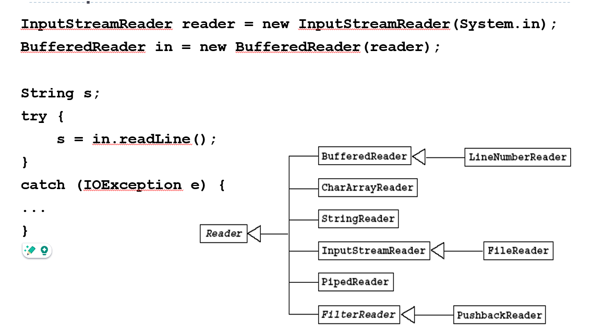
 
# f. File class:
- File is an abstract representation of file and directory path names, for file manipulation: creating, 
deleting, checking data attributes.
- Stream is a sequence of data, for data manipulation: reading, writing.
 
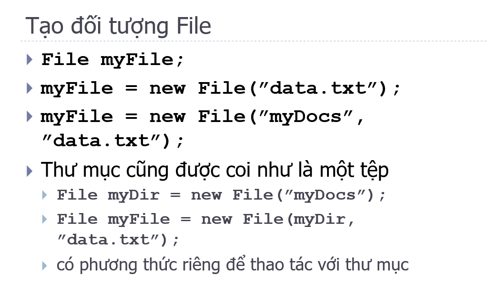
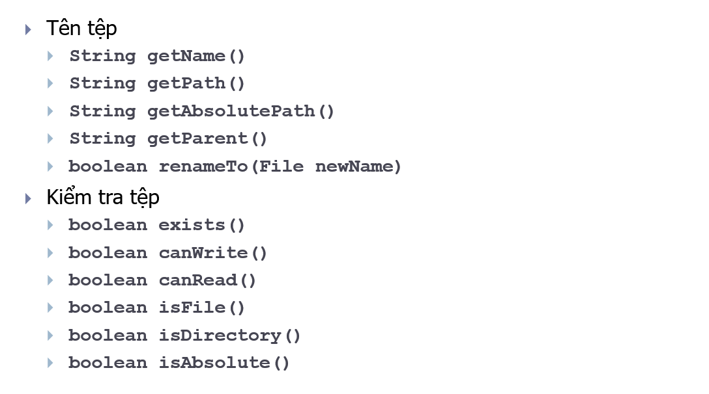
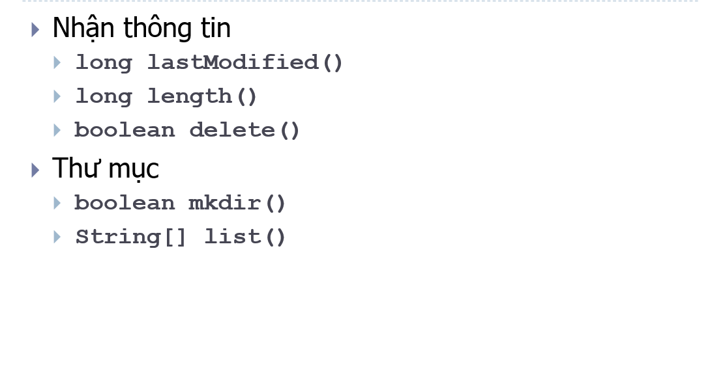
 
- FileReader, FileWriter is object CharStream
# g. Manipulate with data file (consequent)
- FileInputStream: read file: file data to byte
- DataInputStream: read original data : byte to boolean, int, etc
- ObjectInputStream: read object : byte to object
- FileOutputStream: byte to write file
- DataOutputStream: original data to byte
- objectOutputStream: object to byte
 
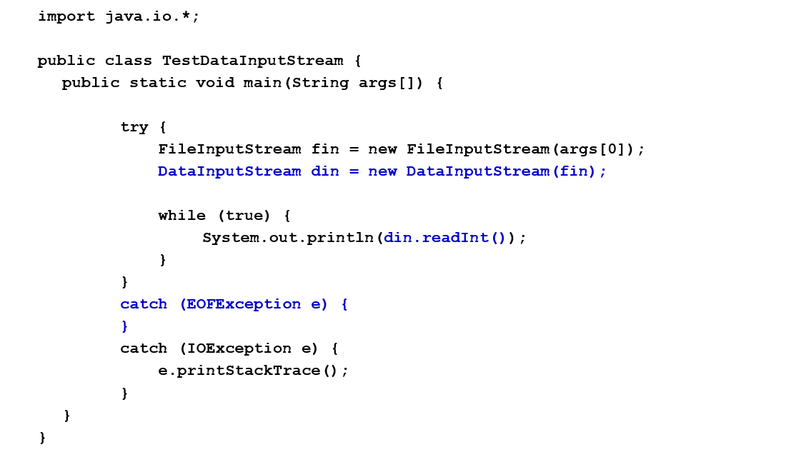
 
# h. Read/write object:
- Must implement Serializable interface
- For example   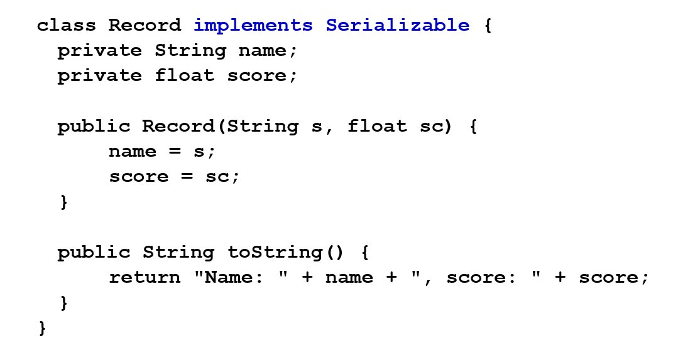 
- 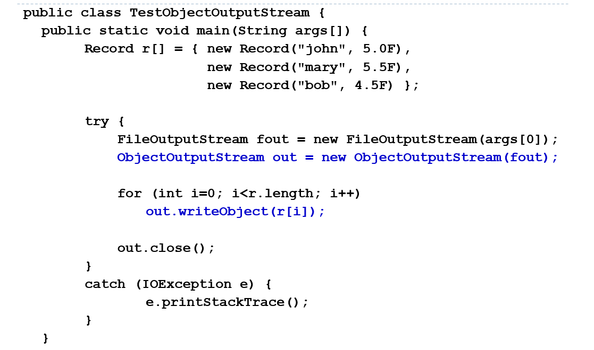 
- 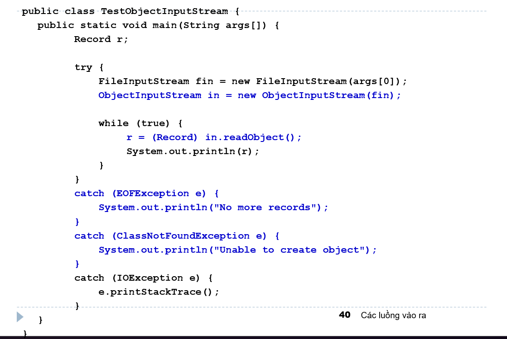  

# i. RandomAccessFile:
- Is a independent class, inheritance from Object directly
- Read/write data randomly
- Record size must be fixed
- Allows you to read and write to a file at any position
- Manipulate in byte unit.
- Some method:  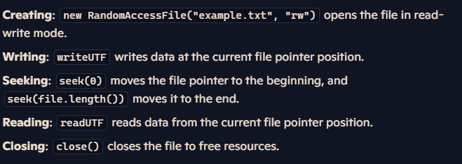 
- Remember seek follow byte.

# j. Scanner
- Initialize with parameter is input object (stream, file, string)
- Method support directly input
- For example:   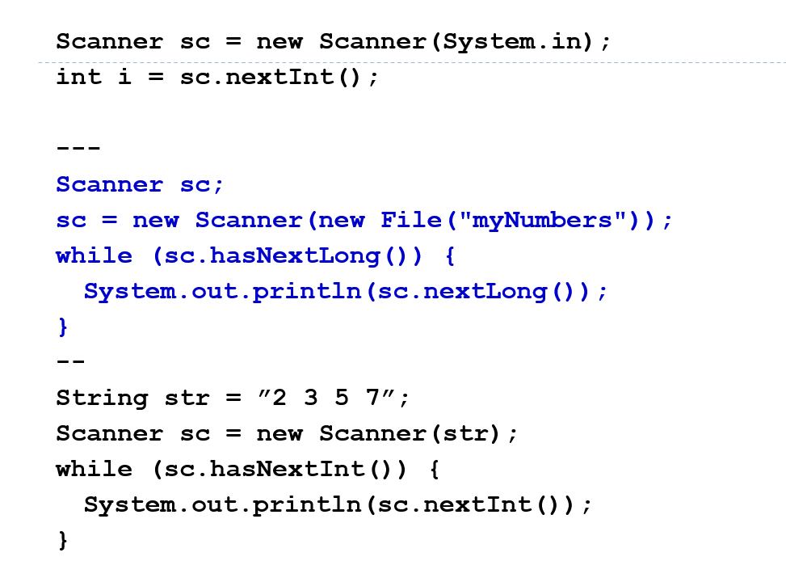  

# k. Input/output abstract:
- No specify source and sink -> improve reuse attribute.
- For example:   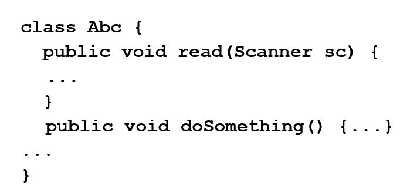 